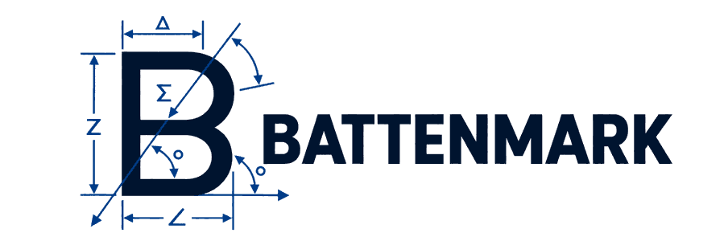

<p align="center">
  
</p>

<p align="center"><strong>Open, backend-neutral CAD infrastructure for AI agents and software.</strong></p>

[](https://github.com/halsyourpal422/Battenmark/actions/workflows/ci.yml)


<p align="center">
  
</p>

Battenmark provides a typed, backend-neutral interface for creating, editing,
inspecting, validating and exporting authoritative CAD geometry across
interchangeable CAD backends. Callers request `create_hole` — never
`PartDesign::Hole`. No transport owns the model; one canonical service does.

## Verified client evidence

As of **September 6, 2026**, two agent/client paths have published Battenmark
proof rather than being treated only as compatibility targets.

### ChatGPT Work on macOS — physical-output proof

```text
ChatGPT Work on macOS
        │
        ▼
    Battenmark
        │
        ▼
FreeCAD 1.1.3 / OpenCascade
        │
        ├── FCStd
        ├── STEP
        ├── STL
        └── 3MF
        │
        ▼
physical 3D print
```

That path has been exercised with real geometry creation, parametric rebuilds,
worker restart/recovery, export, validation, and a successfully printed
**60 × 25 × 4 mm calibration coupon with nominal 3 / 4 / 5 mm through-holes**.

### Claude via MCP — end-to-end CAD workflow proof

Claude has also been validated through Battenmark's MCP surface into the same
authoritative FreeCAD/OpenCascade backend.

A tiny interoperability proof discovered **75 tools**, created a
**20 × 15 × 5 mm** solid, rebuilt it as **1 valid solid / 1,500 mm³**, and
cleaned up without direct FreeCAD bypass.

Claude then completed a **50-revision two-piece Orange Pi 4 Pro enclosure**
workflow entirely through Battenmark. The execution, rebuild/inspection,
persistence and export path worked, and the exported 3MF contains exactly two
manifold objects matching the current CAD mesh to floating-point tolerance.
The enclosure benchmark is deliberately classified **PARTIAL /
CAD_CORRECTION_REQUIRED** because the lid currently uses a solid plug instead of
a hollow friction rim and its vent slots are blind rather than through-cut.

See [client validation evidence](docs/CLIENT_VALIDATION.md) and the
[Orange Pi hard benchmark audit](docs/demos/orange-pi-4-pro-two-piece-2026-09-06.md).

Battenmark is intentionally provider-neutral. Other LLM clients/providers should
remain compatibility targets until equivalent evidence is published for them.
Protocol discovery alone is not treated as proof of autonomous CAD quality.

## Architecture

```text
AI agents / IDE agents / custom software clients
                    │
         MCP / HTTP / Python / CLI
                    │
                    ▼
              Battenmark Core
                    │
         typed CAD operations / CAD IR
                    │
             Backend Registry
                    │
      ┌─────────────┼──────────────────┐
      ▼             ▼                  ▼
   FreeCAD        JSCAD          future adapters
 authoritative    preview      build123d/CadQuery/etc.
   B-rep
```

- **FreeCAD / OpenCascade** — authoritative B-rep kernel (headless JSON-lines worker)
- **JSCAD** — in-process preview/envelope backend (not the source of truth)

## Quickstart

Prerequisites: Node.js ≥ 20 and npm. FreeCAD is **optional** for the core
service and required only for the authoritative B-rep backend.

```bash
npm install
npx tsc --noEmit   # type check
npm test           # fast kernel-free suites (parametric, selectors, registry)
```

### FreeCAD backend

```bash
sh scripts/bootstrap-macos.sh      # macOS: discovers /Applications/FreeCAD.app
sh scripts/install-freecad.sh      # Linux: installs headless 1.0.2 AppImage (no FUSE)
npm run test:freecad               # proves the real worker end-to-end
```

Discovery order: `$AGENTCAD_FREECAD_CMD` → macOS `FreeCAD.app` bundles →
Homebrew → extracted Linux AppImage → `PATH`. See [docs/MACOS.md](docs/MACOS.md)
and [docs/LINUX.md](docs/LINUX.md).

### Transports

| Transport | Entry point |
| --- | --- |
| MCP stdio | `npx agentcad-mcp` |
| HTTP | `npx agentcad serve --port 8787` then `/api/v1/...` (Bearer token via `AGENTCAD_API_TOKEN`) |
| CLI | `npx agentcad --help` |
| Python | [`python/agentcad`](python/agentcad/client.py) — see [examples](examples) |

Python client example:

```python
from agentcad import AgentCad

c = AgentCad(base_url="http://127.0.0.1:8787", token="secret-token")
pid = c.project_create("demo")["project_id"]
c.create_box(pid, 80, 50, 12)
print(c.rebuild(pid)["data"]["volume_mm3"])   # 48000
```

## Golden smoke model

The canonical release smoke test is an **80 × 50 × 12 mm box = 48,000 mm³**,
verified through JSCAD, FreeCAD, HTTP, CLI, MCP and the Python client
(`test:transport-parity`). Do not change this fixture casually.

## Capabilities

- Backend-neutral typed CAD operations with explicit schema (`agentcad_schema_version: 2`)
- FreeCAD/OpenCascade authoritative B-rep; JSCAD preview
- Scalar parameter expressions and dependency evaluation
- Semantic face/edge selectors (`top_perimeter`, …) that re-resolve after edits
- Persistent geometry references (`gref`) with explicit lost/ambiguous errors
- Through / blind / counterbore / countersink holes
- Fillets and chamfers · linear and rectangular patterns
- STEP / FCStd / STL interchange · four-view PNG previews
- Dynamic backend registry with per-backend capability discovery
- One serialized FreeCAD worker with kill/restart recovery
- **Assemblies**: component definitions, persistent instances, grounded frames,
  face mates, axis/concentric alignment, distance & angle constraints
  (see docs/ASSEMBLIES.md)

## Platform status

| Platform | Status |
| --- | --- |
| macOS Apple Silicon | Tier 1 — **hardware verified** (arm64, macOS 26.6.2, FreeCAD 1.1.3) |
| Linux x86_64 | headless / development validated (FreeCAD 1.0.2 AppImage) |
| macOS Intel | unverified |
| Windows | unsupported / unverified |

## Known limitations

This is pre-1.0 alpha software; APIs may change.

- Assemblies support the current rigid subset; nested assemblies, assembly patterns, and advanced joint types remain unsupported
- No circular patterns
- Threads are cosmetic metadata, not helical solids
- Imported STEP is geometry import — not automatic parametric reconstruction
- Native FCStd documents keep historical PartDesign feature shapes; Battenmark
  measures the final Body Tip (summing historical solids double-counts)
- Bodies carrying non-manifold-edge warnings can produce **unreliable B-rep volume
  integrals**; benchmark evidence should cross-check mesh/analytical volume rather
  than treating a raw OpenCascade volume number as ground truth in that condition
- One serialized FreeCAD worker (no pooling)
- Preview rendering is JSCAD, not OCC hidden-line
- Complete topological naming is not solved; persistent `gref` mitigates it

Full list: [docs/LIMITATIONS.md](docs/LIMITATIONS.md).

## Documentation

| Topic | Doc |
| --- | --- |
| Architecture & foundation | [docs/ARCHITECTURE.md](docs/ARCHITECTURE.md) · [docs/FOUNDATION.md](docs/FOUNDATION.md) |
| Operation contract & schema | [docs/CONTRACT.md](docs/CONTRACT.md) · [docs/VERSIONING.md](docs/VERSIONING.md) |
| Backends & kernels | [docs/BACKENDS.md](docs/BACKENDS.md) · [docs/FREECAD.md](docs/FREECAD.md) · [docs/JSCAD.md](docs/JSCAD.md) · [docs/KERNEL.md](docs/KERNEL.md) |
| Transports / clients | [docs/MCP.md](docs/MCP.md) · [docs/HTTP.md](docs/HTTP.md) · [docs/CLI.md](docs/CLI.md) · [docs/PYTHON.md](docs/PYTHON.md) · [docs/CLIENTS.md](docs/CLIENTS.md) · [docs/CLIENT_VALIDATION.md](docs/CLIENT_VALIDATION.md) |
| Service & persistence | [docs/SERVICE.md](docs/SERVICE.md) · [docs/AUTH.md](docs/AUTH.md) |
| Import / export & preview | [docs/IMPORT.md](docs/IMPORT.md) · [docs/PREVIEW.md](docs/PREVIEW.md) |
| Platforms & validation | [docs/MACOS.md](docs/MACOS.md) · [docs/LINUX.md](docs/LINUX.md) · [docs/RELEASE.md](docs/RELEASE.md) |
| Public promotion / adoption | [docs/PROMOTION_PLAN.md](docs/PROMOTION_PLAN.md) |

## Compatibility identifiers

Public branding is **Battenmark**. Historical engineering identifiers remain on
purpose and are a compatibility surface, not a second brand:
`AgentCadService`, `agentcad_schema_version`, `AGENTCAD_*` environment
variables, the `agentcad` / `agentcad-mcp` binaries. The internal service
version `0.5.6` intentionally differs from the release tag; see
[docs/VERSIONING.md](docs/VERSIONING.md).

## Contributing & security

See [CONTRIBUTING.md](CONTRIBUTING.md) and [SECURITY.md](SECURITY.md).
Code of Conduct: [CODE_OF_CONDUCT.md](CODE_OF_CONDUCT.md).

## Phase 8B Release Candidate Evidence

**Qualified candidate SHA:** `31ee9369fe84b35d83932e86bf9fd0b64564aedd`

This SHA passed:
- All 9/9 CI jobs (exact-main matrix)
- FreeCAD discovery and validation
- TypeScript strict check
- Full test suite (kernel-free + FreeCAD + gref + transport parity)
- User Trial 001 (42/42 HTTP operations, USB + microSD holder, 305,698.91 mm³)
- Repository hygiene & legal/release docs review
- Five canonical demos (A–E)

### Five Canonical Demos

| Demo | Description | Result | Evidence |
|------|-------------|--------|----------|
| **A** | Prompt → L-bracket with holes, fillet | PASS (24,046.95 mm³) | [docs/demos/demo-a-l-bracket.md](docs/demos/demo-a-l-bracket.md) |
| **B** | STEP import → inspect → modify → export | PASS (22,846.95 mm³) | [docs/demos/demo-b-import-modify.md](docs/demos/demo-b-import-modify.md) |
| **C** | Iterative correction (spacing change) | PASS (before/after) | [docs/demos/demo-c-iterative.md](docs/demos/demo-c-iterative.md) |
| **D** | Assembly + DOF diagnostics | PASS — mixed transport* | [docs/demos/demo-d-assembly.md](docs/demos/demo-d-assembly.md) |
| **E** | Same surface via 3 selector paths | PASS (3× convergence) | [docs/demos/demo-e-selector-paths.md](docs/demos/demo-e-selector-paths.md) |

*Demo D: Body/multi-body geometry and export were performed over HTTP; full assembly constraints and DOF diagnostics used the MCP transport. The demo met its designed acceptance criteria by intentionally using MCP for the assembly portion.

**User Trial 001:** [docs/demos/user-trial-001.md](docs/demos/user-trial-001.md)

Each demo summary page contains: purpose, prompt summary, result, validation, exact candidate SHA, and a link to the full Drive evidence archive.

### Media Assets

| Asset | Description |
|-------|-------------|
| [Primary Battenmark mark](media/brand/battenmark-mark-primary.png) | Approved standalone dark-on-light geometric B mark |
| [Reversed Battenmark mark](media/brand/battenmark-mark-reversed.png) | Approved light/reversed standalone mark for dark surfaces |
| [Primary Battenmark lockup](media/brand/battenmark-lockup-primary.png) | Approved horizontal mark + wordmark used at the top of this README |
| [GitHub Hero](media/github-hero/github-hero.png) | 1280×640 collage of canonical demo previews |
| [Social Preview](media/social-preview/social-preview.png) | 1280×640 social-card asset |
| [Architecture Diagram](media/architecture/architecture.mmd) | Mermaid flowchart of Battenmark core/transports/backends |
| [Demo Video Script](media/demo-video-script.md) | Flagship public-demo shot list + production notes |
| [Brand Asset Guide](media/brand/README.md) | Canonical usage rules for the approved Battenmark artwork |

### Key Technical Findings (Preserved)

- **Demo A**: Face selector ambiguity after boolean union is avoided by creating features on individual bodies *before* union.
- **Demo B**: STEP import requires workspace path (not raw base64); boolean operation is `boolean_cut`.
- **Demo D**: Full assembly constraint/DOF path uses MCP; HTTP supports body/multi-body geometry/export only.
- **Demo E**: Three resolution paths (face enum, `centroid_near` spatial selector, `created_by` feature reference) converge on identical geometry.

## License

Apache-2.0 for this repository. FreeCAD/OpenCascade are invoked as a separate
LGPL process (the worker scripts run inside FreeCADCmd). See
[LICENSE](LICENSE), [NOTICE](NOTICE) and [THIRD_PARTY_NOTICES.md](THIRD_PARTY_NOTICES.md).
